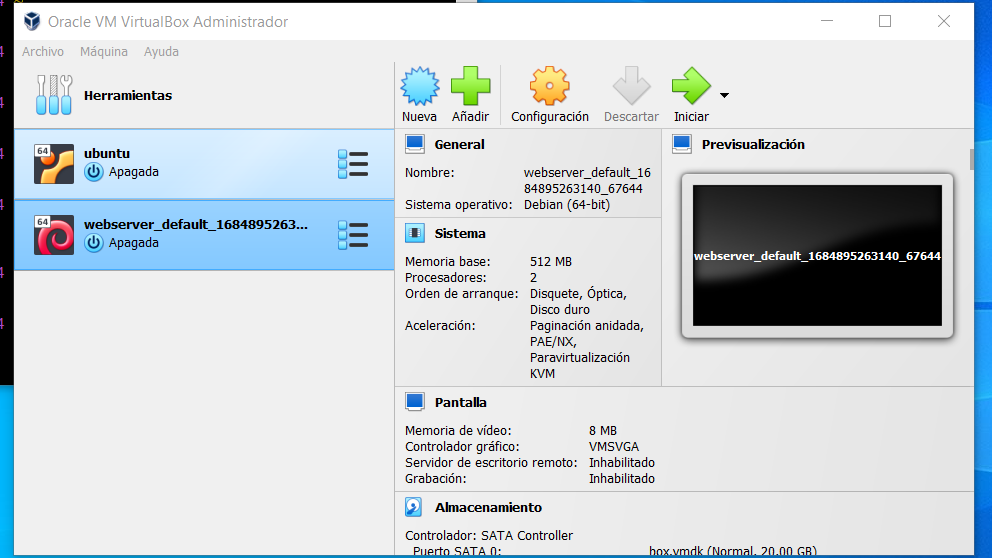

# Workshop 01 - Vagrant
## Hector Arias Martinez

## Instalacion de VirtualBox

Para proceder a la instalacion de VirtualBox debe obtener el instalador que corresponda a su arquitectura de maquina afitriona. Puede utilizar el siguiente enlace para la descarga.

[Virtual Box](https://www.virtualbox.org/wiki/Downloads "Download VirtualBox")



## Instalacion de Vagrant

Es una herramienta de línea de comandos para crear y administrar máquinas virtuales.

Ejecute el "vagrant up" para crear y configurar la máquina virtual como se especifica en Vagrantfile

Para iniciar sesión en la máquina virtual, ejecute:
```bash
vagrant ssh
```

Puede detener la máquina virtual con el siguiente comando:
```bash
vagrant halt
```

Para cerrar todos los recursos creados durante la creación de la máquina, ingrese:
```bash
vagrant destroy
```

## Aprovisionamiento de maquina Bullseye

El primer paso de hacer es 

```bash
mkdir ISW811
cd ISW811
mkdir VMs
cd VMs
mkdir webserver
cd webserver